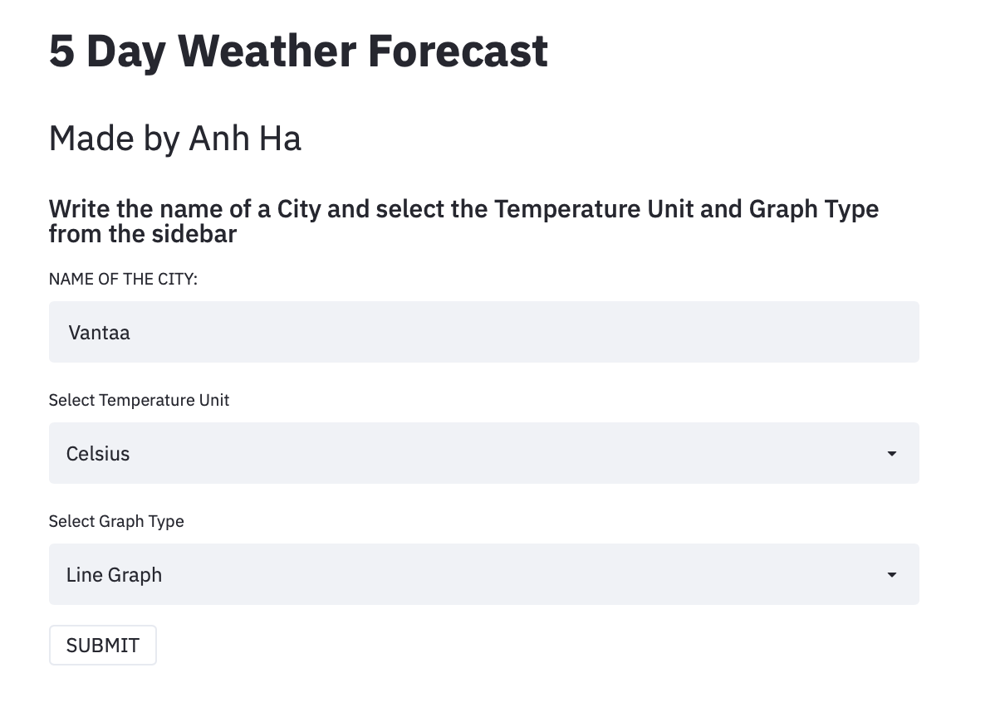
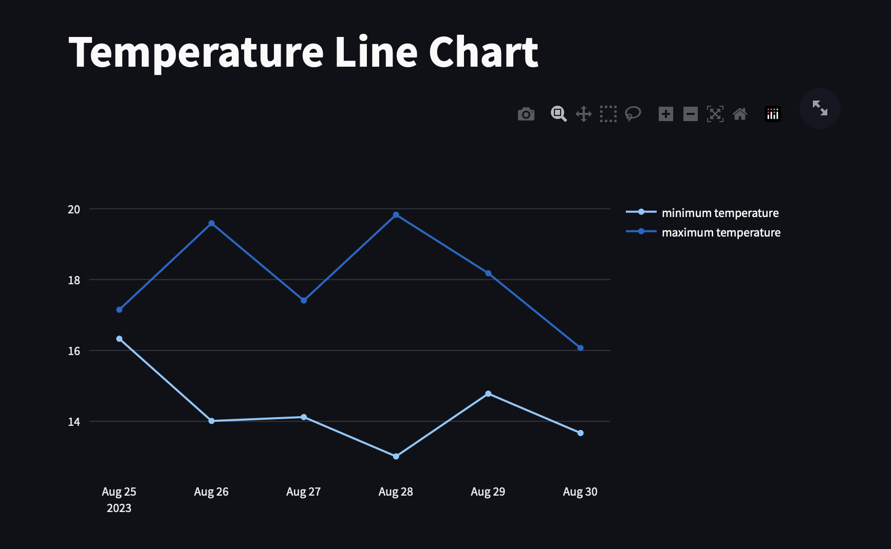
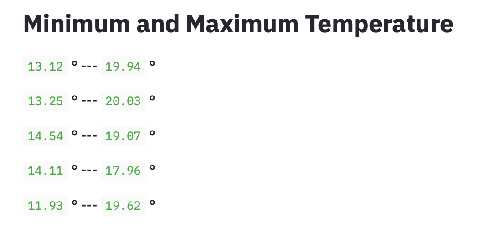
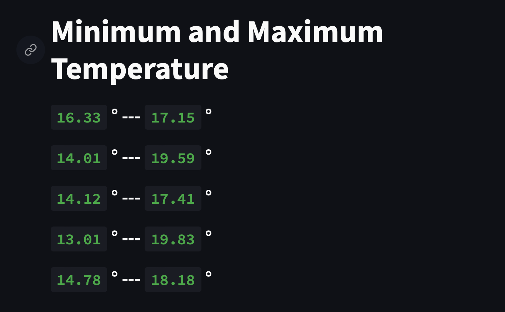
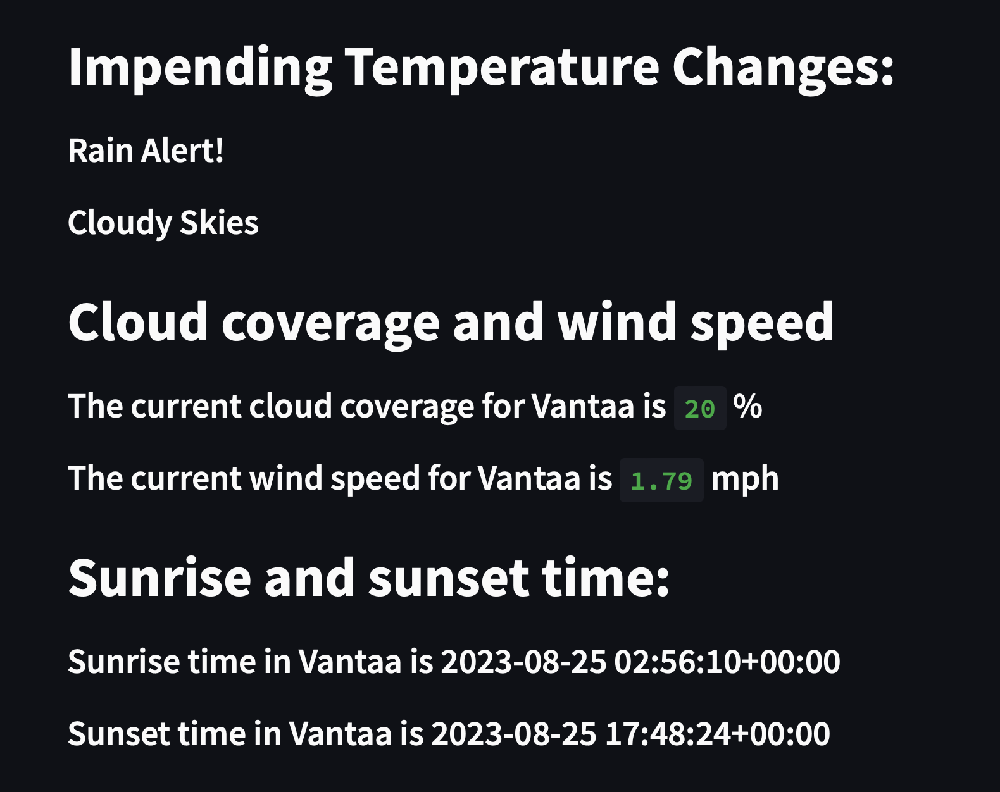

# Weather App Finland - Weather Analysis
A web application to display weather updates in Finland.

The weather application will provide users with real-time weather information, forecasts, and other weather-related data, which can help them make better decisions about their day-to-day activities.

## Keys Features

- 5 day weather forecast
- Impending Weather changes
- Weather Graph
- Sunrise and sunset times
- CLoud Coverage
- Wind Speed

## :iphone: Screenshots

|                                        |                                        |
| -------------------------------------- | -------------------------------------- |
|  |  |
|   |   |
|   |


## Built Using

- `Python` is an interpreted, object-oriented, high-level programming language with dynamic semantics
- `Streamlit` is an open-source Python library that makes it easy to create and share beautiful, custom web apps for machine learning and data science.
- `PyOWM` is a client Python wrapper library for OpenWeatherMap web APIs. It allows quick and easy consumption of OWM data from Python applications via a simple object model and in a human-friendly fashion.
- `Matplotlib` is a plotting library for the Python programming language. It provides an object-oriented API for embedding plots into applications.
- `DateTime` provides a DateTime data type . DateTime objects represent instants in time and provide interfaces for controlling its representation without affecting the absolute value of the object.
- `Plotly` is a Python library interactive, open-source plotting library that supports over 40 unique chart types covering a wide range of statistical, financial, geographic, scientific, and 3-dimensional use-cases.
- Python `Open Weather Map API`

## Required Dependecies that you would need to installed for the development
- `pip3 install DateTime`
- `pip3 install plotly`
- `pip3 install Matplotlib`
- `pip3 install Streamlit`
- `pip3 install PyOWM`

## The required commands for installing all dependencies
For viewing the app in terminal:
```streamlit run weather_analysis.py```


## :fire: Proof of Concept - Demo Link

https://weather-analysis-finland.herokuapp.com

## :bulb: The required commands for Environment Setups:
- `source ENV/bin/activate`
- `python3 -m venv env`
- `pip install flask requests python-dotenv`
- `pip list`
- `pip freeze > requirements.txt`


### Heroku commands:
- `heroku login` (log in to Heroku)
- `heroku create weather-analytics-app-finland`
- `heroku config:set PROTOCOL_BUFFERS_PYTHON_IMPLEMENTATION=python --app weather-analytics-app-finland` (this will use pure-Python parsing and will be much slower)
- `heroku config:set BUILDPACK_URL=https://github.com/andrewychoi/heroku-buildpack-scipy.git` (scikit-learn has scipy as dependency, which doesn’t work on heroku without extra work. install a build pack for your project)
- `git add`
- `git commit -m`
- `heroku stack:set heroku-22` ( run this command if no heroku.yml or Dockerfile was needed for the project. Otherwise, use `heroku stack:set container --app weather-analytics-app-finland`)
- `git push heroku main`
- `heroku open` ( will visit the app using your preferred browser at the URL generated by its app name)
- `heroku ps:scale web=1` (to ensure that at least one instance of the app is running, to force Heroku to spin up a web dyno)
- `heroku restart`
- `heroku logs --tail`