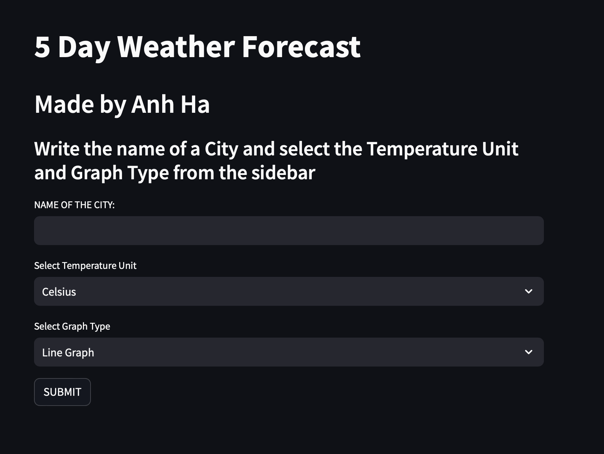

# :sun_behind_small_cloud: Weather App Finland - Weather Analysis
A web application to display weather updates in Finland.

The weather application will provide users with real-time weather information, forecasts, and other weather-related data, which can help them make better decisions about their day-to-day activities.

## :star2: Keys Features

- 5-Day Weather Forecast
- Impending Weather changes
- Weather Graph
- Sunrise and sunset times
- CLoud Coverage
- Wind Speed

## :fire: Proof of Concept - Demo Link

https://weather-analytics-app-finland-1f9d1dd9167c.herokuapp.com

## :iphone: Screenshots

|                                        |                                        |
| -------------------------------------- | -------------------------------------- |
|  |  |
|   |   |
|   |


## :books: Required Libraries and Language for this project

- `Python` is an interpreted, object-oriented, high-level programming language with dynamic semantics
- `Streamlit` is an open-source Python library that makes it easy to create and share beautiful, custom web apps for machine learning and data science.
- `PyOWM` is a client Python wrapper library for OpenWeatherMap web APIs. It allows quick and easy consumption of OWM data from Python applications via a simple object model and in a human-friendly fashion.
- `Matplotlib` is a plotting library for the Python programming language. It provides an object-oriented API for embedding plots into applications.
- `DateTime` provides a DateTime data type . DateTime objects represent instants in time and provide interfaces for controlling its representation without affecting the absolute value of the object.
- `Plotly` is a Python library interactive, open-source plotting library that supports over 40 unique chart types covering a wide range of statistical, financial, geographic, scientific, and 3-dimensional use-cases.
- Python `Open Weather Map API`

## :1st_place_medal: Required dependecies that you would need to installed for the development
```Python
pip3 install DateTime
```
```Python
pip3 install Plotly
```
```Python
pip3 install Matplotlib
```
```Python
pip3 install Streamlit
```
```Python
pip3 install PyOWM
```
```Python
pip install Scipy
```

## :bulb: The required commands for Environment Setups:
```Python
source ENV/bin/activate`
python3 -m venv env
pip install flask requests python-dotenv
pip list
pip freeze > requirements.txt
```

## :desktop_computer: The required commands for installing all dependencies in terminal
For viewing the app in terminal:
```Python
streamlit run weather_analysis.py
```

###  Heroku commands for deployment:
Log in to Heroku and create an app
```Python
heroku login
heroku create weather-analytics-app-finland
git add
git commit -m "[Message here]"
```
Run this command if NO heroku.yml or Dockerfile was needed for the project
```Python
heroku stack:set heroku-22
```
Otherwise, please use:
```Python
heroku stack:set container --app weather-analytics-app-finland
```
Then, to deploy the app created to Heroku, please use
```Python
git push heroku main
```
Use this code to visit the app using your preferred browser at the URL generated by its app name
```Python
heroku open
```
To ensure that at least one instance of the app is running, to force Heroku to spin up a web dyno
```Python
heroku ps:scale web=1
heroku restart
```