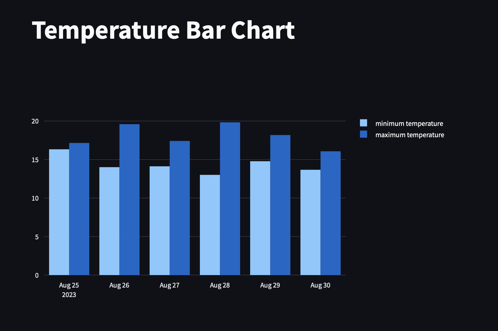

# :sun_behind_small_cloud: Weather App Finland - Weather Analysis
A web application to display weather updates in Finland with user-friendly interface and analytics.

The weather application will provide you with real-time weather information, forecasts, and other weather-related data, allowing full access to a comprehensive range of weather data, such as temperature, humidity, wind speed, and more.

Whether you're a resident or a visitor, staying informed about the weather has never been easier, ensuring that you can make informed decisions about your day.

Plan your day confidently with accurate forecasts and trends, making sure you're prepared for whatever the Helsinki weather has in store.

## :star2: Keys Features
Stay prepared and in the know with this weather application, designed to enhance your daily routines and plans in Helsinki.
- [x] Real-Time Updates: Get instant access to current weather conditions
- [x] Comprehensive Data: View detailed information about 5-Day Weather Forecast such as temperature, humidity, wind speed, and more, all at your fingertips
- [x] Accurate Forecasts: Plan ahead confidently with reliable forecasts that help you make informed decisions.
- [x] Intuitive Interface: Navigate the application effortlessly with a user-friendly design for seamless weather tracking
- [x] Trends and Insights: Stay informed about weather trends over time
- [x] Responsive Design: Access the application from various devices, ensuring you're always connected on the go.
- [x] Reliable Data Sources: Rest assured knowing that our data is sourced from trustworthy weather providers.

## :fire: Proof of Concept - Demo Link

https://weather-analytics-app-finland-1f9d1dd9167c.herokuapp.com

## :iphone: Screenshots

|                                        |                                        |
| -------------------------------------- | -------------------------------------- |
|  |  |
|   |   |
|   |


## :books: Required Libraries and Language for this project

- [x] `Python` : an interpreted, object-oriented, high-level programming language with dynamic semantics
- [x] `Streamlit` : an open-source Python library that makes it easy to create and share beautiful, custom web apps for machine learning and data science.
- [x] `PyOWM` : a client Python wrapper library for OpenWeatherMap web APIs. It allows quick and easy consumption of OWM data from Python applications via a simple object model and in a human-friendly fashion.
- [x] `Matplotlib` : a plotting library for the Python programming language. It provides an object-oriented API for embedding plots into applications.
- [x] `DateTime` provides a DateTime data type . DateTime objects represent instants in time and provide interfaces for controlling its representation without affecting the absolute value of the object.
- [x] `Plotly` : a Python library interactive, open-source plotting library that supports over 40 unique chart types covering a wide range of statistical, financial, geographic, scientific, and 3-dimensional use-cases.
- [x] `Scipy` : a scientific computation library that uses NumPy underneath. SciPy stands for `Scientific Python`. It provides more utility functions for optimization, stats and signal processing. Like NumPy, SciPy is open source so we can use it freely.
- [x] Python `Open Weather Map API`

## :1st_place_medal: Required dependecies that you would need to installed for the development
```Python
pip3 install DateTime
```
```Python
pip3 install Plotly
```
```Python
pip3 install Matplotlib
```
```Python
pip3 install Streamlit
```
```Python
pip3 install PyOWM
```
```Python
pip install Scipy
```

## :bulb: The required commands for Environment Setups:
```Python
source ENV/bin/activate`
python3 -m venv env
pip install flask requests python-dotenv
pip list
pip freeze > requirements.txt
```

## :desktop_computer: The required command for installing all dependencies in terminal
To run the app locally in terminal, please run this command:
```Python
streamlit run weather_analysis.py
```

### :tv: Heroku commands for deployment:
- [x] Log in to Heroku and create an app
```Python
heroku login
heroku create weather-analytics-app-finland
git add
git commit -m "[Your Message here]"
```
- [x] Run this command if NO heroku.yml or Dockerfile was needed for the project
```Python
heroku stack:set heroku-22
```
- [x] In other cases, please use:
```Python
heroku stack:set container --app weather-analytics-app-finland
```
- [x] Then, to deploy the app created to Heroku, please use:
```Python
git push heroku main
```
- [x] Use this code to visit the app using your preferred browser at the URL generated by its app name
```Python
heroku open
```
- [x] To ensure that at least one instance of the app is running, to force Heroku to spin up a web dynos
```Python
heroku ps:scale web=1
heroku restart
```